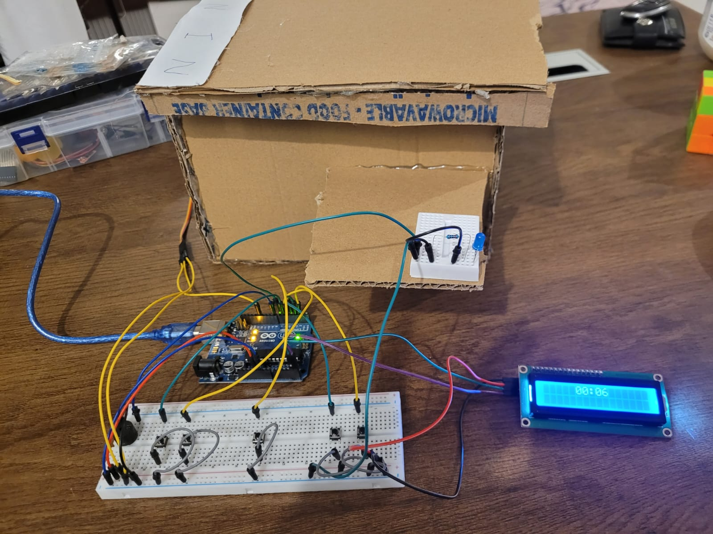
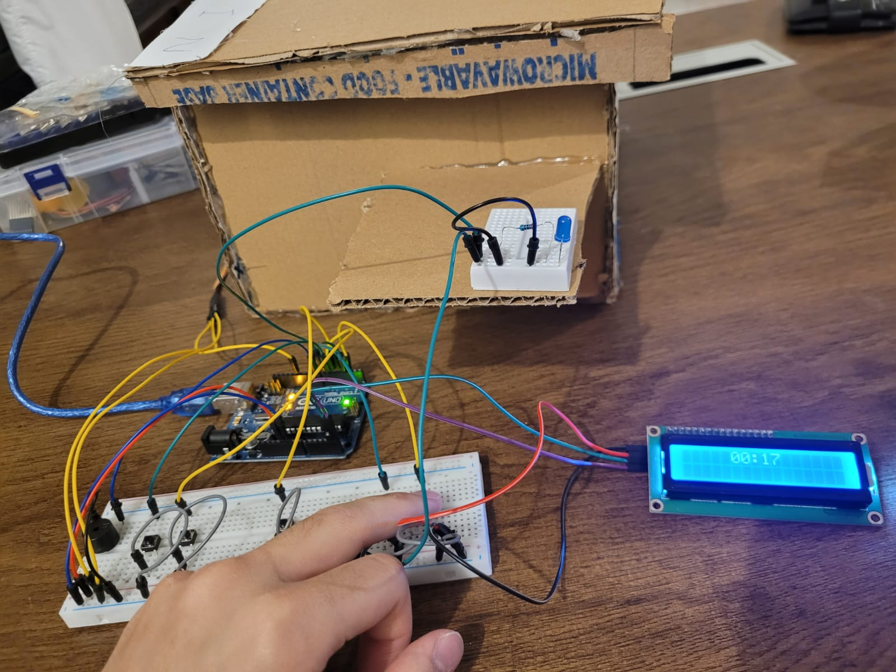
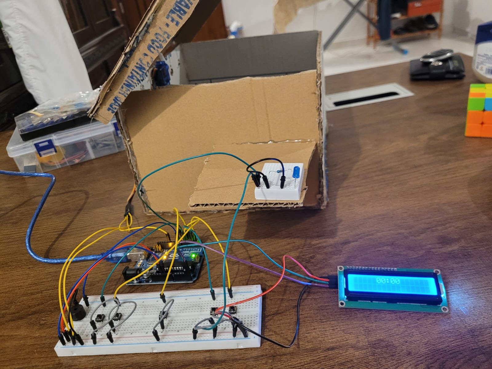

# Arduino---Countdown-Box

# Description:
The "Countdown Box" project is a hand-made cardboard box system that includes a servo motor, LCD screen, blue LED, buzzer, and five push buttons.

Project concept:

On the right side, there are two buttons to increase or decrease the seconds.

On the left side, two buttons are used to increase or decrease the minutes.

In the center, there is a button to start or stop the timer.

---

How it works:

The selected time is displayed on the LCD and can be adjusted using the buttons.

Pressing the start button begins the countdown.

Pressing the start button again pauses or resumes the timer.

When the countdown reaches zero:

The buzzer sounds.

The blue LED turns on.

The box opens using the servo motor.

After 5 seconds, the box automatically closes.

---

The project uses the millis() function instead of delay() to measure the 5-second duration, allowing the program to stay responsive without blocking code execution.


# Pictures:





# Code Below:
```cpp
#include <LiquidCrystal_I2C.h>
#include <Servo.h>

Servo servo;
LiquidCrystal_I2C lcd(0x27, 16, 2);

byte increasSec = 2;
byte decreasSec = 3;
byte increasMin = 5;
byte decreasMin = 6;
byte start = 4;
byte blueLED = 7;
byte buzzer = 8;
unsigned long time = 50000;
unsigned long savedTime = time;
unsigned long totalSeconds = time / 1000;
bool isRun = false;
bool isOpen = false;
bool countRunning = false;
bool startPressed = false;


int seconds, minutes;
unsigned long lastTime, openTime, lastStartPressed, prevTime;


void showOnLCD() {
  if (minutes == 0) {
    lcd.setCursor(5, 0);
    lcd.print("  ");
    lcd.setCursor(5, 0);
    lcd.print("00");
  }
  
  else if (minutes < 10) {
    lcd.setCursor(5, 0);
    lcd.print("  ");
    lcd.setCursor(6, 0);
    lcd.print(minutes);
  }

  else{
    lcd.setCursor(5, 0);
    lcd.print("  ");
    lcd.setCursor(5, 0);
    lcd.print(minutes);
  }

  if (seconds == 0) {
    lcd.setCursor(8, 0);
    lcd.print("  ");
    lcd.setCursor(8, 0);
    lcd.print("00");
  }

  else if (seconds < 10) {
    lcd.setCursor(8, 0);
    lcd.print("  ");
    lcd.setCursor(8, 0);
    lcd.print('0');
    lcd.setCursor(9, 0);
    lcd.print(seconds);
  }

  else{
    lcd.setCursor(8, 0);
    lcd.print("  ");
    lcd.setCursor(8, 0);
    lcd.print(seconds);
  }
}

void printZero() {
  lcd.setCursor(5,0);
  lcd.print("  ");
  lcd.setCursor(5,0);
  lcd.print("00");
  lcd.setCursor(8,0);
  lcd.print("  ");
  lcd.setCursor(8,0);
  lcd.print("00");
}

void setup() {
  for (byte i=2; i<7; i++) { // Setup buttons
    pinMode(i, INPUT_PULLUP);
  }

  pinMode(blueLED, OUTPUT);

  lcd.init();
  lcd.backlight();
  servo.attach(12);
  servo.write(90);
  Serial.begin(9600);
  lcd.setCursor(5,0);
  lcd.print("00:00");
  delay(1000);
}

void loop() {
  totalSeconds = time / 1000;
  minutes = totalSeconds / 60;
  seconds = totalSeconds % 60;
  if (time != prevTime){
    showOnLCD();
    prevTime = time;
  }

  if (digitalRead(increasSec) == LOW && time < 5999000) {
    time+=1000;
  }

  if (digitalRead(decreasSec) == LOW && time > 0) {
    time-=1000;
  }

  if (digitalRead(increasMin) == LOW && time < 5939000) {
    time+=60000;
  }

  if (digitalRead(decreasMin) == LOW && minutes > 0) {
    time-=60000;
  }

  // Start check start btn value
  bool startValue = digitalRead(start);

  if (startValue == LOW && !startPressed && millis() - lastStartPressed > 300) {
    savedTime = time;
    startPressed = true;
    lastStartPressed = millis();
    countRunning = !countRunning;
  }

  if (startValue == HIGH && startPressed){
    startPressed = false;
  }

  if (countRunning && !startPressed){
    if (millis() - lastTime >= 1000){
      lastTime = millis();
      time -= 1000;
      // showOnLCD();
    }   
  }

  if (time == 0 && isOpen == false && countRunning){
    countRunning = false;
    printZero();
    openTime = millis();
    isOpen = true;
    tone(buzzer, 700, 1000);
    digitalWrite(blueLED, HIGH);
    delay(1000);
    digitalWrite(blueLED, LOW);

    for (byte z=90; z>0; z-=5){
      servo.write(z);
      delay(100);
    }

    time = savedTime;

  }


  if (millis() - openTime > 5000 && isOpen == true) {
    servo.write(90);
    isOpen = false;
    delay(500);
  }

  Serial.print("Minutes= ");
  Serial.println(minutes);
  Serial.print("Seconds= ");
  Serial.println(seconds);
  Serial.print("Time = ");
  Serial.println(time);
  delay(10);
}

```
